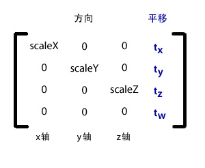

<p align="center">4x4矩形知识</p>
=

[toc]

## 一、基本概念

以下是引用自ActionScript3的Matrix3D类的语言参考：

> Matrix3D 类使用一个 4x4 正方形矩阵，即一个由四行和四列数字构成的表，其中容纳了用于转换的数据。矩阵的前三行容纳每个 3D 轴 (x, y, z) 的数据。平移信息位于最后一列中。方向和缩放数据位于前三个列中。缩放因子是位于前三个列中的对角数字。以下是 Matrix3D 元素的表示形式：



创建 Matrix3D 对象。可以使用一个由 16 个数字组成的矢量来初始化 Matrix3D 对象，其中，每四个元素可以是一列。创建 Matrix3D 对象之后，可以使用 rawData 属性访问该对象的矩阵元素。

> 如果未定义任何参数，则构造函数会生成一个恒等或单位 Matrix3D 对象。在矩阵表示法中，恒等矩阵中的主对角线位置上的所有元素的值均为一，而所有其他元素的值均为零。恒等矩阵的 rawData 属性的值为 1, 0, 0, 0, 0, 1, 0, 0, 0, 0, 1, 0, 0, 0, 0, 1。恒等矩阵的位置或平移值为 Vector3D(0, 0, 0)，旋转设置为 Vector3D(0, 0, 0)，缩放值为 Vector3D(1, 1, 1)。

## 二、应用示例

将某个点转换到另外一个空间的转换算法：

``` typescript
static transformPosition(worldMatrix: Float32Array, vec3Pos: Float32Array, out: Laya.Vector3 = null): Laya.Vector3 {
        let m = worldMatrix;
        if (!out) {
            out = new Laya.Vector3();
        }
        var x: number = vec3Pos[0];
        var y: number = vec3Pos[1];
        var z: number = vec3Pos[2];
        out.x = x * m[0] + y * m[4] + z * m[8] + m[12];
        out.y = x * m[1] + y * m[5] + z * m[9] + m[13];
        out.z = x * m[2] + y * m[6] + z * m[10] + m[14];
        return out;
    }
    
```

