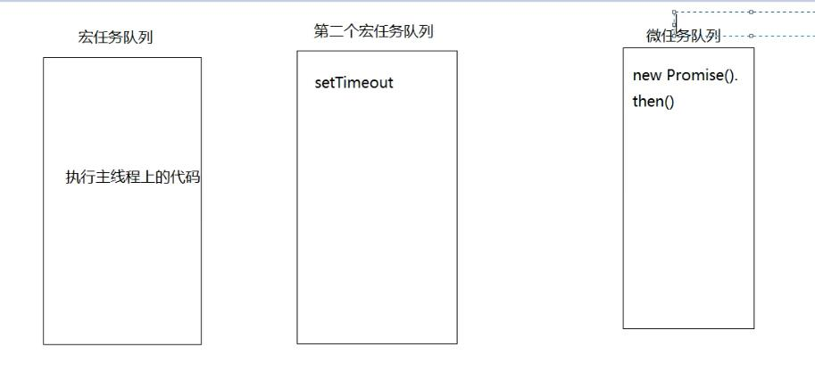
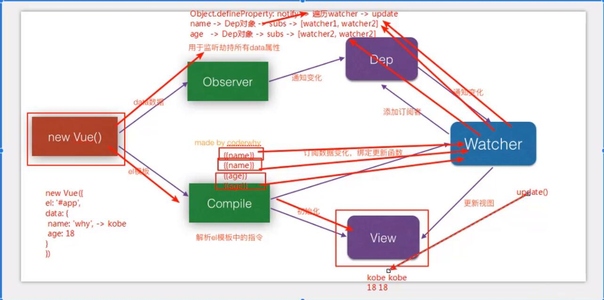

<p style="text-align:center;">Web客户端笔试</p>
=

[toc]

## 1、冒泡排序
```javascript
var arr=[5,4,3,2,1];
for(var i=0;i<arr.length;i++){
    for(var j=0;j<arr.length-i;j++){
        var temp=arr[j];
        if(temp>arr[j+1]){
            arr[j]=arr[j+1];
            arr[j+1]=temp;
        }
    }
}
console.log(arr);
//双重循环，嵌套循环遍历长度递减
```
## 2、反转数组
```javascript
    var arr=[1,2,3,4,5];
    for(var i=0;i<arr.length/2;i++){
        var temp=arr[i];
        arr[i]=arr[arr.length-1-i];
        arr[arr.length-1-i] = temp;
    }
    console.log(arr);
    //arr.reverse();
    //遍历长度减半
```
## 3、去掉数组中重复的数据
```javascript
var arr=[1,1,1,2,2,3,4,5,6,7,8,8];
var arr1=[];
arr1[0]=arr[0];
for(var i=0;i<arr.length;i++){
    for(var j=0;j<arr1.length;j++){
        var temp=arr1[j];
        if(arr[i]!=temp&&j==arr1.length-1){
            arr1.push(arr[i]);
        }else if(arr[i]==temp){
            break;
        }
    }
}
console.log(arr1);
//嵌套循环，不相等比较，必须比完最后一个值
```
## 4、1px物理像素的实现
方案一
```javascript
//像素比
var dpr = window.devicePixelRatio;
//缩放比
var scale=1/dpr;
var width=document.documentElement.clientWidth;
//获取meta标签
var metaNode=document.querySelector('meta[name="viewport"]');
metaNode.setAttribute('content','width=device-width,initial-scale='+scale+',user-scalable=no,minimum-scale=1.0,maximum-scale=1.0');
//页面中的元素宽度，高度，比例反向乘回来
var htmlNode=document.querySelector('html');
htmlNode.style.fontSize=width*dpr+"px";
```
方案二
```css
#box{
    width:200px;
    height:200px;
    position:relative;
}
#box:before{
    content:'';
    position:absolute;
    left:0;
    bottom:0;
    width:100%;
    height:1px;
    background:#000;
}
@media screen and (-webkit-min-device-pixel-ratio:2){
    #box:before{
        transform:scaleY(0.5);
    }
}
@media screen and (-webkit-min-device-pixel-ratio:3){
    #box:before{
        transform:scaleY(0.333333)
    }
}
```
## 5、使用flex实现元素水平垂直居中（新版本与老版本）
//常规方式
```css
#wrap{
    width:500px;
    height:500px;
    background:grey;
    position:relative;
}
#wrap .box{
    width:200px;
    height:200px;
    background:pink;

    //方案三
    position:absolute;
    top:50%;
    left:50%;
    transform:translate(-50%,-50%);

    方案二
    /* position:absolute;
    top:50%;
    left:50%;
    margin-left:-100px;
    margin-top:-100px; */
    //方案一
    /* position:absolute;
    top:0;
    left:0;
    right:0;
    bottom:0;
    margin:auto; */
}
```
//新版本flex
```css
//flex方式
#wrap{
    width:500px;
    height:500px;
    background:grey;

    display:flex;
    justify-content:center;
    align-items:center;
}
#wrap .box{
    width:200px;
    height:200px;
    background:pink;
}
```
//老版本实现flex
```css
#wrap{
    width:500px;
    height:500px;
    background:grey;

    display:-webkit-box;
    -webkit-box-pack:center;
    -webkit-box-align:center;
}
#wrap .box{
    width:200px;
    height:200px;
    background:pink;
}
```
## 6、用纯CSS创建一个三角形
```css
#box{
    width:0;
    height:0;
    border:1px solid;
    border-top-color:red;
    border-right-color:transparent;
    border-left-color:transparent;
    border-bottom-color:transparent;
}
```
## 7、移动端rem适配
根元素设置像素大小
```javascript
var width=document.documentElement.clientWidth;
var htmlNode=document.querySelector('html');
var hemlNode.style.fontSize=width+'px';
```
## 8、求背景图片左边到#box盒子左边框外侧的距离
```css
*{
    margin:0;
    padding:0;
}
#box{
    width:100px;
    height:200px;
    background:pink;
    padding:100px;
    border:80px solid blue;
    background-image:url('img/1.png');
    background-repeat:no-repeat;
    background-origin:content-box;/*背景图片起始源的位置*/
    background-position:-50px 0;
}
/*答案130px*/
```
## 9、函数节流和防抖
函数节流：一个函数执行一次后，只有大于设定的执行周期后才会执行第二次。
```javascript
/*
* fn 要被节流的函数
* delay 规定的时间
*/
function throttle(fn,delay){
    var lastTime=0;
    return function(){
        var nowTime=Date.now();
        if(nowTime-lastTime>delay){
            fn.call(this);
            lastTime=nowTime;
        }
    }
}
```
函数防抖：一个需要频繁执行的函数，在规定时间内，只让最后一次生效，前面的不生效。
```javascript
function debounce(fn,delay){
    var timer=null;
    return function(){
        clearTimeout(timer);
        timer=setTimeout(function(){
            fn.apply(this);
        },delay);
    }
}
```
## 10、跨域
1、同源策略
- 是浏览器安全策略
- 协议名、域名、端口号必须完全一致。
2、跨域
违背同源策略就会产生跨域
3、解决跨域
jsonp cors 服务器代理...

jsonp前端实现规则:
```javascript
//创建script标签
var script=document.createElement('script');
//设置回调函数
function getData(data){
    //数据请求回调来会被触发的函数
    console.log(data);
}
//设置script的src属性，设置请求地址
script.src='http://localhost:3000?callback=getData';
//让script生效
document.body.appendChild(script);
```
## 11、nodejs事件轮询机制
分为6个阶段：
1、timers定时器阶段
计时和执行到点的定时器回调函数
2、pending callbacks
某些系统操作（例如TCP错误类型）的回调函数
3、idle,prepare
准备工作
4、poll轮询阶段（轮询队列）
如果轮询队列不为空，依次同步取出轮询队列中第一个回调函数执行，直到轮询队列为空或者达到系统最大的限制。
- 如果轮询队列为空
   - 如果之前设置过setImmediate函数
   直接进入下一个check阶段
   - 如果之前没有设置过setImmediate函数
    在当前poll阶段等待
       直到轮询队列添加回调函数，就去第一个情况执行
       如果定时器到点了，也会去下一个阶段

5、check查阶段
执行setImmediate设置的回调函数
6、close callbacks 关闭阶段
 执行close事件的回调函数


*process.nextTick()任意阶段优先执行*

## 12、从一个url地址到最终页面渲染完成，发生了什么？
1、DNS解析，将域名地址解析为ip地址
 - 浏览器DNS缓存
 - 系统DNS缓存
 - 路由器DNS缓存
 - 网络运营商DNS缓存
 - 递归搜索：blog.baidu.com
    - .com域名下查找DNS解析
    - .baidu域名下查找DNS解析
    - .blog域名下查找DNS解析
    - 出错了

2、TCP连接：TCP三次握手
- 第一次握手，由浏览器发起，告诉服务器我要发送请求了
- 第二次握手，由服务器发起，告诉浏览器我准备接受了，你赶紧发送吧
- 第三次握手，由浏览器发送，告诉服务器，我马上就发了，准备接受吧

3、发送请求
- 请求报文：HTTP协议的通信内容

4、接受响应
- 响应报文

5、渲染页面
- 遇见HTML标记，浏览器调用HTML解析器解析成Token并构建成dom树
- 遇见style/link标记，浏览器调用css解析器，处理css标记并构建cssom树
- 遇到script标记，调用javascript解析器，处理script代码（绑定事件，修改dom树/cssom树）
- 将dom树和cssom树合并成一个渲染树
- 根据渲染树来计算布局，计算每个节点的几何信息（布局）
- 将各个节点颜色绘制到屏幕上（渲染）

注意：
 这五个步骤不一定按照顺序执行，如果dom树或cssom树被修改了，可能会执行多次布局和渲染。
 往往实际页面中，这些步骤都会执行多次的

 6、断开连接：TCP四次挥手
  - 第一次，浏览器发起，发送给服务器，东西发送完了（请求报文），你准备关闭吧
  - 第二次，服务器发起，告诉浏览器，我东西接受完了（请求报文），我准备关闭了，你也准备吧
  - 第三次，服务器发起，告诉浏览器，我东西发送完了（响应报文），你准备关闭吧
  - 第四次，由浏览器发起，告诉服务器，我东西接受完了，我准备关闭了（响应报文），你也准备吧

## 13、闭包
```javascript
function fun(n,o){
    console.log(o);
    return {
        fun:function(m){
            return fun(m,n);
        }
    }
}
var a=fun(0); //undefine
a.fun(1);   //0
a.fun(2);   //0
a.fun(3);   //0

var b=fun(0).fun(1).fun(2).fun(3) //undefine,0,1,2

var c=fun(0).fun(1) //undefine,0
c.fun(2) //1
c.fun(3) //1 
```
## 14、变量提升和执行上下文
js引擎在代码正式执行之前会做一个预处理工作：
1、收集变量
2、收集函数
   将var后边的变量定义但不赋值var xx=undefine
   function(){}提前定义该函数

执行上下文(execute context)EC
理解：代码执行的环境
时机：代码正式执行之前会进入到执行环境
工作：
   - 1、创建变量对象：
     - 1）变量
     - 2）函数及函数的参数
     - 3）全局：window
     - 4）局部：抽象的但是确实存在
   - 2、确认this的指向
     - 1)全局：this ---> window
     - 2)局部: this ---> 调用其的对象
   - 3、创建作用域链
     - 父级作用域链+当前的变量对象
   - 4、扩展：
     -  ECObj={
          变量对象：{变量，函数，函数的形参}
          scopeChain:父级作用域链+当前的变量对象，
          this:{window||调用其的对象}
      }

## 15、宏任务和微任务
宏任务
分类：setTimeout setInterval requrestAnimationFrame
1、宏任务所处的队列就是宏任务队列
2、第一个宏任务队列中只有一个任务：执行主线程的js代码
3、宏任务队列可以有多个
4、宏任务队列执行完毕，查看微任务队列，有则执行，无则执行宏任务

微任务
分类：new Promise().then(回调)process.nextTick
1、微任务所处的队列就是微任务队列
2、只有一个微任务队列
3、在上一个宏任务队列执行完毕后，如果有微任务队列就会执行微任务队列中的所有任务

```javascript
console.log('----------start-----------');

setTimeout(()=>{
    console.log('setTimeout');
},0);
new Promise((resolve,reject)=>{
    for(var i=0;i<5;i++){
        console.log(i);
    }
    resolve();
}).then(()=>{
    console.log('promise实例成功回调执行');
})

console.log('-----------end-------------');
```


## 16、小程序快速入门
略
## 17、小程序和mpVue对比简介
mpVue框架--腾讯出品
...
## 18、比较React与Vue
1、相同点
- 1、都有组件化开发和Virtual DOM
- 2、都支持props进行父子组件间数据通信
- 3、都支持数据驱动视图，不直接操作真实DOM，更新状态数据界面就自动更新
- 4、都支持服务器端渲染
- 5、都有支持native的方案，React的React Native，Vue的Weex
2、不同点
- 1、数据绑定：vue实现了数据的双向绑定，react数据流动是单向的
- 2、组件写法不一样，React推荐的做法是JSX，也就是把HTML和CSS全都写进JavaScript了，即'all in js'；Vue推荐的做法是webpack+vue-loader的单文件组件格式，即html，css，js写在同一个文件
- 3、state对象在react应用中不可变的，需要使用setState方法更新状态；在vue中，state对象不是必须的，数据由属性在vue对象中管理
- 4、virtual DOM不一样，vue会跟踪每一个组件的依赖关系，不需要重新渲染整个组件树。而对于React而言，每当应用的状态被改变时，全部组件都会重新渲染，所以react中会需要shouldComponentUpdate这个生命周期函数方法来进行控制
- 5、React严格上只针对MVC的view层，Vue则是MVVM模式

## 19、Redux管理状态的机制
略
## 20、Vue组件间通信方式
1、通信种类
- 1、父组件向子组件通信
- 2、子组件向父组件通信
- 3、隔代组件间通信
- 4、兄弟组件间通信

2、实现通信方式
- 1、props
- 2、vue自定义事件
- 3、消息订阅与发布
- 4、vuex
- 5、slot

3、方式1:props
- 1、通过一般属性实现父向子通信
- 2、通过函数属性实现子向父通信
- 3、缺点：隔代组件和兄弟组件间通信比较麻烦

4、方式2：vue自定义事件
- 1、vue内置实现，可以代替函数类型的props
  - a.绑定监听：<MyComp @eventName="callback">
  - b.触发（分发）事件：this.$emit("eventName",data)
- 2、缺点：只适合于子向父通信

5、方式3：消息订阅与发布
1、需要引入消息订阅与发布的实现库，如pubsub-js
- a. 订阅消息：PubSub.subscribe('msg',(msg,data)=>P{})
- b. 发布消息：PubSub.publish('msg',data)
2、优点：此方式可用于任意关系组件间的通信

6、方式4：vuex
1、是什么：vuex是vue官方提供的集中式管理vue多组件共享状态数据的vue插件
2、优点：对组件间关系没有限制，且相比于pubsub库管理更集中，更方便

7、方式5：slot
1、是什么：专门用来实现父向子传递带数据的标签
  - a. 子组件
  - b. 父组件
2、注意：通信的标签模板是在父组件中解析好后再传递给子组件的

## 21、Vuex管理状态的机制
1、对Vuex基本理解
- 1、是什么：Vuex是一个专为Vue.js应用程序开发的状态管理的vue插件
- 2、作用：集中式管理vue多个组件共享的状态和从后台获取数据

2、工作机制
...

## 22、Vue的MVVM实现
1）理解
- 1、Vue作为MVVM模式的实现库的2种技术
  - a、模板解析
  - b、数据绑定
- 2、模板解析：实现初始化显示
  - a、解析大括号表达式
  - b、解析指令
- 3、数据绑定：实现更新显示
  - a、通过数据劫持实现

## 23、Vue响应式原理
1、使用Object.defineProperty()方法监听对象属性值的变化。
2、使用观察者设计模式，监听对象值的变化，并做出响应。


