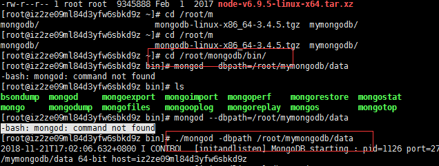
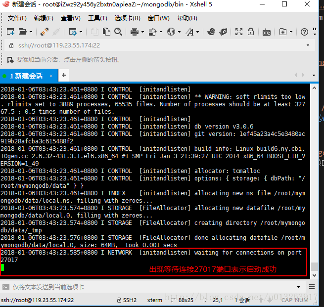

<p align="center">阿里云安装nodejs和mongodb</p>
=

[toc]

## 一、部署Nodejs

&ensp; &ensp; 参考阿里云官方文档<a href='https://help.aliyun.com/document_detail/50775.html' target='_blank'>部署Node.js项目(CentOS)</a>

## 二、mongodb相关

### 1、安装mongodb
在终端输入命令等待安装:

``` 
wget https://fastdl.mongodb.org/linux/mongodb-linux-x86_64-3.4.5.tgz
```

耗时比较长，请耐心等待

解压安装包:tar zxvf mongodb-linux-x86_64-3.4.5.tgz

重命令文件夹为mongodb：mv mongodb-linux-x86_64-3.4.5 mongodb

创建存放mongodb数据的data文件夹：mkdir /root/mymongodb、mkdir /root/mymongodb/data

注意：这里的/root指的是你的阿里云服务器根目录的名字，默认为root

### 2、启动mongodb

cd到你的mongodb的bin目录，例如我的mongodb安装路径为:cd /root/mongodb/bin

运行mongodb服务：mongod --dbpath=[刚才创建的data文件夹路径]，例如我这里是 ./mongod -dbpath /root/mymongodb/data




如果出现wating for connection on port 27017表示成功

==注意: 以守护进程的方式运行MongoDB，创建服务进程，相当于nohup ... &==

``` 
nohup mongodb/bin/mongod --dbpath mongodb/0706 &
```

与

``` 
mongodb/bin/mongod --dbpath mongodb/0706 --fork 
```

