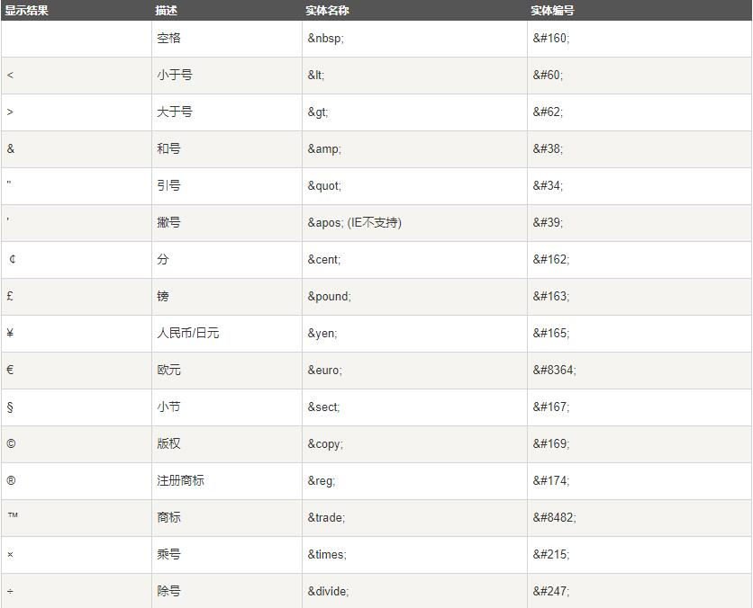

<p align='center'>HTML 教程</p>
=
[toc]

## 一、基础

### 1、实例

``` html
<!DOCTYPE html>
<html>

<head>
    <meta charset="utf-8">
    <title>菜鸟教程(runoob.com)</title>
</head>

<body>

    <h1>我的第一个标题</h1>

    <p>我的第一个段落。</p>

</body>

</html>
```

**实例解析**
\<! DOCTYPE html> 声明为 HTML5 文档
\<html> 元素是 HTML 页面的根元素
\<head> 元素包含了文档的元（meta）数据，如 \<meta charset="utf-8"> 定义网页编码格式为 utf-8。
\<title> 元素描述了文档的标题
\<body> 元素包含了可见的页面内容
\<h1> 元素定义一个大标题
\<p> 元素定义一个段落
==注：在浏览器的页面上使用键盘上的 F12 按键开启调试模式，就可以看到组成标签。==

### 2、什么是html？

HTML 是用来描述网页的一种语言。

* HTML 指的是超文本标记语言: HyperText Markup Language
* HTML 不是一种编程语言，而是一种标记语言
* 标记语言是一套标记标签 (markup tag)
* HTML 使用标记标签来描述网页
* HTML 文档包含了HTML 标签及文本内容
* HTML文档也叫做 web 页面

### 3、HTML标签

HTML 标记标签通常被称为 HTML 标签 (HTML tag)。

* HTML 标签是由尖括号包围的关键词，比如 <html>
* HTML 标签通常是成对出现的，比如 <b> 和 </b>
* 标签对中的第一个标签是开始标签，第二个标签是结束标签
* 开始和结束标签也被称为开放标签和闭合标签

### 4、HTML元素

"HTML 标签" 和 "HTML 元素" 通常都是描述同样的意思.

但是严格来讲, 一个 HTML 元素包含了开始标签与结束标签。

### 5、Web浏览器

Web浏览器（如谷歌浏览器，Internet Explorer，Firefox，Safari）是用于读取HTML文件，并将其作为网页显示。

浏览器并不是直接显示的HTML标签，但可以使用标签来决定如何展现HTML页面的内容给用户。

### 6、<! DOCTYPE> 声明

<! DOCTYPE>声明有助于浏览器中正确显示网页。

网络上有很多不同的文件，如果能够正确声明HTML的版本，浏览器就能正确显示网页内容。

doctype 声明是不区分大小写的，以下方式均可：

``` html
<!DOCTYPE html>

<!DOCTYPE HTML>

<!doctype html>

<!Doctype Html>
```

#### 1、通用声明

**HTML5**

``` html
<!DOCTYPE html>
```

**HTML4.01**

``` html
<!DOCTYPE HTML PUBLIC "-//W3C//DTD HTML 4.01 Transitional//EN" "http://www.w3.org/TR/html4/loose.dtd">
```

**XHTML1.0**

``` html
<!DOCTYPE html PUBLIC "-//W3C//DTD XHTML 1.0 Transitional//EN" "http://www.w3.org/TR/xhtml1/DTD/xhtml1-transitional.dtd">
```

#### 2、中文编码

目前在大部分浏览器中，直接输出中文会出现中文乱码的情况，这时候我们就需要在头部将字符声明为 UTF-8 或 GBK。

``` html
<!DOCTYPE html>
<html>

<head>
    <meta charset="UTF-8">
    <title>页面标题</title>
</head>

<body>

    <h1>我的第一个标题</h1>

    <p>我的第一个段落。</p>

</body>

</html>
```

### 7、HTML标签

#### 1、HTML水平线

<hr> 标签在 HTML 页面中创建水平线。

``` html
<p>这是一个段落。</p>
<hr>
<p>这是一个段落。</p>
<hr>
<p>这是一个段落。</p>
```

#### 2、HTML 提示 - 如何查看源代码

你是否看过一些网页然后惊叹它是如何实现的。

如果您想找到其中的奥秘，只需要单击右键，然后选择"查看源文件"（IE）或"查看页面源代码"（Firefox），其他浏览器的做法也是类似的。这么做会打开一个包含页面 HTML 代码的窗口。

#### 3、HTML文本格式化标签

* \<b>	定义粗体文本
* \<em>	定义着重文字
* \<i>	定义斜体字
* \<small>	定义小号字
* \<strong>	定义加重语气
* \<sub>	定义下标字
* \<sup>	定义上标字
* \<ins>	定义插入字
* \<del>	定义删除字

#### 4、HTML"计算机输出"标签

* \<code>	定义计算机代码
* \<kbd>	定义键盘码
* \<samp>	定义计算机代码样本
* \<var>	定义变量
* \<pre>	定义预格式文本

#### 5、HTML 引文, 引用, 及标签定义

* \<abbr>	定义缩写
* \<address>	定义地址
* \<bdo>	定义文字方向
* \<blockquote>	定义长的引用
* \<q>	定义短的引用语
* \<cite>	定义引用、引证
* \<dfn>	定义一个定义项目。

#### 6、\<a>标签

id属性
在HTML文档中插入ID:

``` html
<a id="tips">有用的提示部分</a>
```

在HTML文档中创建一个链接到"有用的提示部分(id="tips"）"：

``` html
<a href="#tips">访问有用的提示部分</a>
```

或者，从另一个页面创建一个链接到"有用的提示部分(id="tips"）"：

``` html
<a href="https://www.runoob.com/html/html-links.html#tips">
    访问有用的提示部分</a>
```

##### 1、基本的注意事项 - 有用的提示

注释： 请始终将正斜杠添加到子文件夹。假如这样书写链接：href="https://www.runoob.com/html"，就会向服务器产生两次 HTTP 请求。这是因为服务器会添加正斜杠到这个地址，然后创建一个新的请求，就像这样：href="https://www.runoob.com/html/"。

### 8、HTML\<head>

#### 1、HTML \<head>元素
\<head> 元素包含了所有的头部标签元素。在 \<head>元素中你可以插入脚本（scripts）, 样式文件（CSS），及各种meta信息。

可以添加在头部区域的元素标签为: \<title>, \<style>, \<meta>, \<link>, \<script>, \<noscript>, and \<base>.

#### 2、HTML \<title> 元素

\<title> 标签定义了不同文档的标题。

\<title> 在 HTML/XHTML 文档中是必须的。

\<title> 元素:

* 定义了浏览器工具栏的标题
* 当网页添加到收藏夹时，显示在收藏夹中的标题
* 显示在搜索引擎结果页面的标题

一个简单的 HTML 文档:

``` html
<!DOCTYPE html>
<html>

<head>
    <meta charset="utf-8">
    <link rel="shortcut icon" href="图片url">
    <title>文档标题</title>
</head>

<body>
    文档内容......
</body>

</html>
```

#### 3、HTML \<base> 元素

\<base> 标签描述了基本的链接地址/链接目标，该标签作为HTML文档中所有的链接标签的默认链接:

``` html
<head>
    <base href="http://www.runoob.com/images/" target="_blank">
</head>
```

#### 4、HTML \<link> 元素

<link> 标签定义了文档与外部资源之间的关系。

<link> 标签通常用于链接到样式表:

``` html
<head>
    <link rel="stylesheet" type="text/css" href="mystyle.css">
</head>
```

#### 5、HTML\<style>元素

\<style> 标签定义了HTML文档的样式文件引用地址.

在\<style> 元素中你也可以直接添加样式来渲染HTML 文档:

``` html
<head>
    <style type="text/css">
        body {
            background-color: yellow
        }

        p {
            color: blue
        }
    </style>
</head>
```

#### 6、HTML \<meta> 元素

meta标签描述了一些基本的元数据。

\<meta> 标签提供了元数据. 元数据也不显示在页面上，但会被浏览器解析。

META 元素通常用于指定网页的描述，关键词，文件的最后修改时间，作者，和其他元数据。

元数据可以使用于浏览器（如何显示内容或重新加载页面），搜索引擎（关键词），或其他Web服务。

\<meta> 一般放置于 \<head> 区域
**\<meta> 标签- 使用实例**
为搜索引擎定义关键词:

``` html
<meta name="keywords" content="HTML, CSS, XML, XHTML, JavaScript">
```

为网页定义描述内容:

``` html
<meta name="description" content="免费 Web & 编程 教程">
```

定义网页作者:

``` html
<meta name="author" content="Runoob">
```

每30秒钟刷新当前页面:

``` html
<meta http-equiv="refresh" content="30">
```

#### 7、HTML \<script> 元素

\<script>标签用于加载脚本文件，如： JavaScript。

\<script> 元素在以后的章节中会详细描述。
**HTML head 元素**
\<head>	定义了文档的信息
\<title>	定义了文档的标题
\<base>	定义了页面链接标签的默认链接地址
\<link>	定义了一个文档和外部资源之间的关系
\<meta>	定义了HTML文档中的元数据
\<script>	定义了客户端的脚本文件
\<style>	定义了HTML文档的样式文件

### 9、HTML样式-CSS

CSS (Cascading Style Sheets) 用于渲染HTML元素标签的样式.
CSS 是在 HTML 4 开始使用的, 是为了更好的渲染HTML元素而引入的.

CSS 可以通过以下方式添加到HTML中:

* 内联样式- 在HTML元素中使用"style" 属性
* 内部样式表 -在HTML文档头部 \<head> 区域使用\<style> 元素 来包含CSS
* 外部引用 - 使用外部 CSS 文件

最好的方式是通过外部引用CSS文件.

#### 1、内联样式

当特殊的样式需要应用到个别元素时，就可以使用内联样式。

``` html
<p style="color:blue;margin-left:20px;">这是一个段落。</p>
```

**HTML样式实例 - 背景颜色**
背景色属性（background-color）定义一个元素的背景颜色：

``` html
<body style="background-color:yellow;">
    <h2 style="background-color:red;">这是一个标题</h2>
    <p style="background-color:green;">这是一个段落。</p>
</body>
```

早期背景色属性（background-color）是使用 bgcolor 属性定义。
**HTML 样式实例 - 字体, 字体颜色 ，字体大小**

``` html
<h1 style="font-family:verdana;">一个标题</h1>
<p style="font-family:arial;color:red;font-size:20px;">一个段落。</p>
```

现在通常使用font-family（字体），color（颜色），和font-size（字体大小）属性来定义文本样式，而不是使用\<font>标签。
**HTML 样式实例 - 文本对齐方式**

``` html
<h1 style="text-align:center;">居中对齐的标题</h1>
<p>这是一个段落。</p>
```

文本对齐属性 text-align取代了旧标签 \<center> 。

#### 2、内部样式表

当单个文件需要特别样式时，就可以使用内部样式表。你可以在\<head> 部分通过 \<style>标签定义内部样式表:

``` html
<head>
    <style type="text/css">
        body {
            background-color: yellow;
        }

        p {
            color: blue;
        }
    </style>
</head>
```

#### 3、外部样式表

当样式需要被应用到很多页面的时候，外部样式表将是理想的选择。

``` html
<head>
    <link rel="stylesheet" type="text/css" href="mystyle.css">
</head>
```

**HTML 样式标签**
\<style>	定义文本样式
\<link>	定义资源引用地址

### 11、表格

表格由 \<table> 标签来定义。每个表格均有若干行（由 \<tr> 标签定义），每行被分割为若干单元格（由 \<td> 标签定义）。字母 td 指表格数据（table data），即数据单元格的内容。数据单元格可以包含文本、图片、列表、段落、表单、水平线、表格等等。

``` html
<table border="1">
    <tr>
        <th>Header 1</th>
        <th>Header 2</th>
    </tr>
    <tr>
        <td>row 1, cell 1</td>
        <td>row 1, cell 2</td>
    </tr>
    <tr>
        <td>row 2, cell 1</td>
        <td>row 2, cell 2</td>
    </tr>
</table>
```

### 12、列表

无序列表(ul)、有序列表(ol)、自定义列表(dl)

``` html
<ul>
    <li>Coffee</li>
    <li>Milk</li>
</ul>

<ol>
    <li>Coffee</li>
    <li>Milk</li>
</ol>

<dl>
    <dt>Coffee</dt>
    <dd>- black hot drink</dd>
    <dt>Milk</dt>
    <dd>- white cold drink</dd>
</dl>
```

**提示: 列表项内部可以使用段落、换行符、图片、链接以及其他列表等等。**

### 13、区块

HTML 可以通过 <div> 和 <span>将元素组合起来。
**HTML 区块元素**
大多数 HTML 元素被定义为块级元素或内联元素。
块级元素在浏览器显示时，通常会以新行来开始（和结束）。
实例: \<h1>, \<p>, \<ul>, \<table>
**HTML 内联元素**
内联元素在显示时通常不会以新行开始。
实例: \<b>, \<td>, \<a>, \
**HTML \<div> 元素**
HTML \<div> 元素是块级元素，它可用于组合其他 HTML 元素的容器。

\<div> 元素没有特定的含义。除此之外，由于它属于块级元素，浏览器会在其前后显示折行。

如果与 CSS 一同使用，\<div> 元素可用于对大的内容块设置样式属性。

\<div> 元素的另一个常见的用途是文档布局。它取代了使用表格定义布局的老式方法。使用 \<table> 元素进行文档布局不是表格的正确用法。\<table> 元素的作用是显示表格化的数据。
HTML \<span> 元素
HTML \<span> 元素是内联元素，可用作文本的容器

\<span> 元素也没有特定的含义。

当与 CSS 一同使用时，\<span> 元素可用于为部分文本设置样式属性。
**HTML 分组标签**

* \<div>	定义了文档的区域，块级 (block-level)
* \<span>	用来组合文档中的行内元素， 内联元素(inline)

### 14、HTML表单

表单是一个包含表单元素的区域。

表单元素是允许用户在表单中输入内容, 比如：文本域(textarea)、下拉列表、单选框(radio-buttons)、复选框(checkboxes)等等。

表单使用表单标签 \<form> 来设置:

``` html
<form>
    First name: <input type="text" name="firstname"><br>
    Last name: <input type="text" name="lastname">
</form>

<form>
    Password: <input type="password" name="pwd">
</form>

<form>
    <input type="radio" name="sex" value="male">Male<br>
    <input type="radio" name="sex" value="female">Female
</form>

<form>
    <input type="checkbox" name="vehicle" value="Bike">I have a bike<br>
    <input type="checkbox" name="vehicle" value="Car">I have a car
</form>

<form name="input" action="html_form_action.php" method="get">
    Username: <input type="text" name="user">
    <input type="submit" value="Submit">
</form>
```

### 15、框架

通过使用框架，你可以在同一个浏览器窗口中显示不止一个页面。
**Iframe - 设置高度与宽度**
height 和 width 属性用来定义iframe标签的高度与宽度。

属性默认以像素为单位, 但是你可以指定其按比例显示 (如："80%")。

``` html
<iframe src="demo_iframe.htm" width="200" height="200"></iframe>
```

**Iframe - 移除边框**
frameborder 属性用于定义iframe表示是否显示边框。

设置属性值为 "0" 移除iframe的边框:

``` html
<iframe src="demo_iframe.htm" frameborder="0"></iframe>
```

**使用iframe来显示目标链接页面**
iframe可以显示一个目标链接的页面

目标链接的属性必须使用iframe的属性，如下实例:

``` html
<iframe src="demo_iframe.htm" name="iframe_a"></iframe>
<p><a href="http://www.runoob.com" target="iframe_a">RUNOOB.COM</a></p>
```

**注意： 因为 a 标签的 target 属性是名为 iframe_a 的 iframe 框架，所以在点击链接时页面会显示在 iframe框架中。**

### 16、HTML字符实体

==实体名称对大小写敏感！==

虽然 html 不区分大小写，但实体字符对大小写敏感。
<a href='https://www.runoob.com/tags/ref-entities.html/' target='_blank'>HTML完整实体参考手册</a>

### 17、HTML 统一资源定位器（Uniform Resource Locators）

URL 是一个网页地址。

URL可以由字母组成，如"runoob.com"，或互联网协议（IP）地址： 192.68.20.50。大多数人进入网站使用网站域名来访问，因为 名字比数字更容易记住。

### 18、HTML速查列表

HTML 速查列表. 你可以打印它，以备日常使用。

#### 1、HTML基本文档

``` html
<!DOCTYPE html>
<html>

<head>
    <title>文档标题</title>
</head>

<body>
    可见文本...
</body>

</html>
```

#### 2、基本标签（Basic Tags）

``` html
<h1>最大的标题</h1>
<h2> . . . </h2>
<h3> . . . </h3>
<h4> . . . </h4>
<h5> . . . </h5>
<h6>最小的标题</h6>

<p>这是一个段落。</p>
<br> （换行）
<hr> （水平线）
<!-- 这是注释 -->
```

#### 3、文本格式化(Formatting)

``` html
<b>粗体文本</b>
<code>计算机代码</code>
<em>强调文本</em>
<i>斜体文本</i>
<kbd>键盘输入</kbd>
<pre>预格式化文本</pre>
<small>更小的文本</small>
<strong>重要的文本</strong>

<abbr> （缩写）
    <address> （联系信息）
        <bdo> （文字方向）
            <blockquote> （从另一个源引用的部分）
                <cite> （工作的名称）
                    <del> （删除的文本）
                        <ins> （插入的文本）
                            <sub> （下标文本）
                                <sup> （上标文本）
```

#### 4、链接(Links)

``` html
普通的链接：<a href="http://www.example.com/">链接文本</a>
图像链接： <a href="http://www.example.com/"></a>
邮件链接： <a href="mailto:webmaster@example.com">发送e-mail</a>
书签：
<a id="tips">提示部分</a>
<a href="#tips">跳到提示部分</a>
```

#### 5、图片（Images）

``` html

```

#### 6、样式/区块（Styles/Sections）

``` html
<style type="text/css">
    h1 {
        color: red;
    }

    p {
        color: blue;
    }
</style>
<div>文档中的块级元素</div>
<span>文档中的内联元素</span>
```

#### 7、无序列表

``` html
<ul>
    <li>项目</li>
    <li>项目</li>
</ul>
```

#### 8、有序列表

``` html
<ol>
    <li>第一项</li>
    <li>第二项</li>
</ol>
```

#### 9、自定义列表

``` html
<dl>
    <dt>项目 1</dt>
    <dd>描述项目 1</dd>
    <dt>项目 2</dt>
    <dd>描述项目 2</dd>
</dl>
```

#### 10、表格（Tables）

``` html
<table border="1">
    <tr>
        <th>表格标题</th>
        <th>表格标题</th>
    </tr>
    <tr>
        <td>表格数据</td>
        <td>表格数据</td>
    </tr>
</table>
```

#### 11、框架（Iframe）

``` html
<iframe src="demo_iframe.htm"></iframe>
```

#### 12、表单（Forms）

``` html
<form action="demo_form.php" method="post/get">
    <input type="text" name="email" size="40" maxlength="50">
    <input type="password">
    <input type="checkbox" checked="checked">
    <input type="radio" checked="checked">
    <input type="submit" value="Send">
    <input type="reset">
    <input type="hidden">
    <select>
        <option>苹果</option>
        <option selected="selected">香蕉</option>
        <option>樱桃</option>
    </select>
    <textarea name="comment" rows="60" cols="20"></textarea>

</form>
```

#### 13、实体（Entities）

``` html
&lt; 等同于 < 
&gt; 等同于>
&#169; 等同于 ©
```

