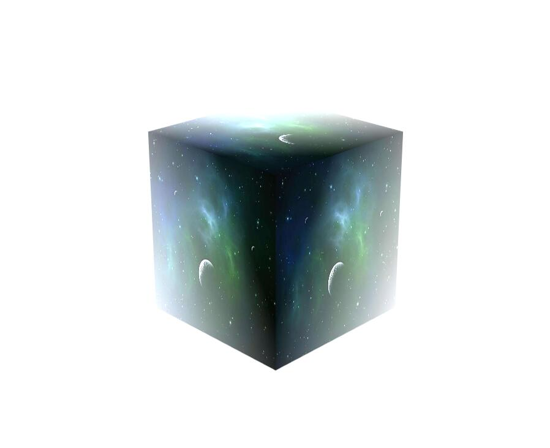

<p align="center">雾化效果</p>
=

[toc]

## 一、效果展示



## 二、原理

1、设置一个雾化区域，确定它的起点和终点，分别到视点的距离，比如（5, 200）；
2、计算雾化因子, 当物体远离视点时，系数变小；

``` typescript
//u_FogDist(5,200)
//v_Dist物体顶点到视点的距离
 float fogFactor = clamp((u_FogDist.y - v_Dist) / (u_FogDist.y - u_FogDist.x), 0.0, 1.0);
```

3、将雾化因子和颜色进行线性混合

``` typescrript
//越远雾化程度越高 u_FogColor * (1 - fogFactor) + texColor * fogFactor 
//(mix返回线性混合的x和y，如：x⋅(1−a)+y⋅a)
vec3 color = mix(u_FogColor, vec3(texColor.r,texColor.g,texColor.b), fogFactor);
```

## 三、代码示例

``` typescript
        //顶点着色器
        var vs: string =
            "attribute vec4 a_Position;\n" +
            "uniform mat4 u_MvpMatrix;\n" +
            "attribute vec2 a_Texcoord0;\n" +
            "varying vec2 v_Texcoord0;\n" +
            "varying float v_Dist;\n" +

            "void main(){\n" +
            "gl_Position = u_MvpMatrix * a_Position;\n" +
            //物体顶点位置转换到mvp空间后，它的w分量正好=它的z分量乘以-1，可以近似为顶点到视点的距离
            "v_Dist=gl_Position.w;\n" +
            "v_Texcoord0= a_Texcoord0;\n}";
        //片元着色器
        var ps: string =
            "#ifdef FSHIGHPRECISION\n" +
            "precision highp float;\n" +
            "#else\n" +
            "precision mediump float;\n" +
            "#endif\n" +
            "varying vec2 v_Texcoord0;\n" +
            "varying float v_Dist;\n" +
            "uniform sampler2D u_DiffuseTexture;\n" +
            "uniform vec3 u_FogColor;\n" + //雾的颜色
            "uniform vec2 u_FogDist;\n" + //雾化的起点和终点，分别到视点的距离(starting point distance, end point distance)
            "void main(){\n" +
            //计算雾化因子（当它远离眼睛位置时，系数变小）
            "float fogFactor = clamp((u_FogDist.y - v_Dist) / (u_FogDist.y - u_FogDist.x), 0.0, 1.0);\n" +
            "vec4 texColor=texture2D(u_DiffuseTexture, v_Texcoord0);\n" +
             //越远雾化程度越高 u_FogColor * (1 - fogFactor) + texColor * fogFactor (mix返回线性混合的x和y，如：x⋅(1−a)+y⋅a)
            "vec3 color = mix(u_FogColor, vec3(texColor.r,texColor.g,texColor.b), fogFactor);\n" +
            "gl_FragColor = vec4(color, texColor.a);\n" +
            "}\n";
```

           

