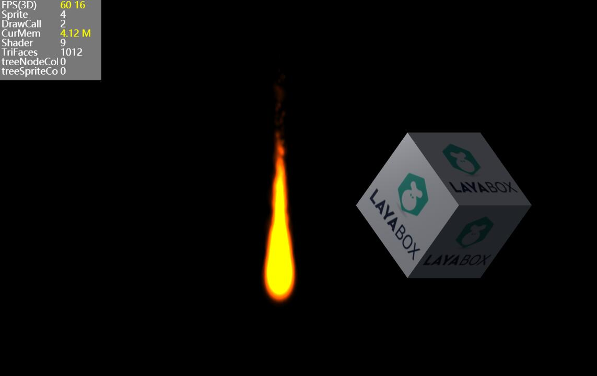

<p align="center">基于Laya引擎实现的粒子效果</p>
=
[toc]

#### 一、概述



粒子实现的基本思路，将所有粒子看作是在一个大网格中，将网格数据，比如顶点数据、索引数据，一次上传到数据缓冲中，这样只需一次drawcall即可，非常节省性能。（因为所有粒子用的纹理和着色器都是相同的，所以只需draw一次，而不用每个粒子都draw一次）。

#### 二、Laya实现自定义网格

##### 1、自定义粒子网格类ParticleMesh，继承PrimitiveMesh类并重写相应方法
==Laya. PrimitiveMesh==类是所有网格类的基类，所以自定义网格类需要继承自此类。
==recreateResource()== 重写此方法, 用于将网格数据提交到数据缓冲区。
==_render()== 重写渲染方法，将绘制类型改成独立三角形Laya. WebGLContext. TRIANGLES。

``` typescript
class ParticleMesh extends Laya.PrimitiveMesh {

    ...

    constructor(config) {
        super();
        ...
        
        this.activeResource();
        this._positions = this._getPositions();
        this._generateBoundingObject();
    }

    recreateResource() {
        let t = this;
        var oldCapacity: number = t.capacity;
        var newCapacity: number = Math.min(t.mMaxCapacity, t.capacity + t._particleAmount);
        this._numberVertices = newCapacity * 4;
        this._numberIndices = newCapacity * 6;

        var baseVertexData: VertexData = new VertexData(4);
        baseVertexData.setTexCoords(0, 0.0, 0.0);
        baseVertexData.setTexCoords(1, 1.0, 0.0);
        baseVertexData.setTexCoords(2, 0.0, 1.0);
        baseVertexData.setTexCoords(3, 1.0, 1.0);
        // t.mTexture.adjustVertexData(baseVertexData, 0, 4);
        for (let j = 0; j < baseVertexData.rawData.length; j++) {
            if (baseVertexData.rawData[j] == undefined) {
                baseVertexData.rawData[j] = 0;
            }
        }
        for (var i: number = oldCapacity; i < newCapacity; ++i) {
            var numVertices: number = i * 4;
            var numIndices: number = i * 6;

            t.mParticles[i] = t.createParticle();
            t.mVertexData.append(baseVertexData);

            t.mIndices[numIndices] = numVertices;
            t.mIndices[Math.floor(numIndices + 1)] = numVertices + 1;
            t.mIndices[Math.floor(numIndices + 2)] = numVertices + 2;
            t.mIndices[Math.floor(numIndices + 3)] = numVertices + 3;
            t.mIndices[Math.floor(numIndices + 4)] = numVertices + 2;
            t.mIndices[Math.floor(numIndices + 5)] = numVertices + 1;
        }
        var vertexDeclaration = VertexPositionColorTexture.vertexDeclaration;
        var vertices = new Float32Array(t.mVertexData.rawData);
        var indices = new Uint16Array(this.mIndices);
        this._vertexBuffer = new Laya.VertexBuffer3D(vertexDeclaration, this._numberVertices,/*laya.webgl.WebGLContext.STATIC_DRAW*/0x88E4, true);
        this._indexBuffer = new Laya.IndexBuffer3D(/*laya.d3.graphics.IndexBuffer3D.INDEXTYPE_USHORT*/"ushort", this._numberIndices,/*laya.webgl.WebGLContext.STATIC_DRAW*/0x88E4, true);
        this._vertexBuffer.setData(vertices);
        this._indexBuffer.setData(indices);
        this.memorySize = (this._vertexBuffer._byteLength + this._indexBuffer._byteLength) * 2;
        this.completeCreate();
    }

    _render(state) {
        Laya.WebGL.mainContext.drawElements(Laya.WebGLContext.TRIANGLES, this._numberIndices,/*laya.webgl.WebGLContext.UNSIGNED_SHORT*/0x1403, 0);
        Laya.Stat.drawCall++;
        Laya.Stat.trianglesFaces += this._numberIndices / 3;
    }
```
##### 2、更新粒子运动数据
``` typescript
    protected advanceParticle(aParticle: Particle, passedTime: number): void {
        let t = this;
        var particle: Particle = aParticle as Particle;

        var restTime: number = particle.totalTime - particle.currentTime;
        passedTime = restTime > passedTime ? passedTime : restTime;
        particle.currentTime += passedTime;

        if (t.mEmitterType == t.EMITTER_TYPE_RADIAL) {
            particle.emitRotation += particle.emitRotationDelta * passedTime;
            particle.emitRadius -= particle.emitRadiusDelta * passedTime;
            particle.x = t.mEmitterX - Math.cos(particle.emitRotation) * particle.emitRadius;
            particle.y = t.mEmitterY + Math.sin(particle.emitRotation) * particle.emitRadius;

            if (particle.emitRadius < t.mMinRadius)
                particle.currentTime = particle.totalTime;
        }
        else {
            var distanceX: number = particle.x - particle.startX;
            var distanceY: number = particle.y - particle.startY;
            var distanceScalar: number = Math.sqrt(distanceX * distanceX + distanceY * distanceY);
            if (distanceScalar < 0.01) distanceScalar = 0.01;

            var radialX: number = distanceX / distanceScalar;
            var radialY: number = distanceY / distanceScalar;
            var tangentialX: number = radialX;
            var tangentialY: number = radialY;

            radialX *= particle.radialAcceleration;
            radialY *= particle.radialAcceleration;

            var newY: number = tangentialX;
            tangentialX = -tangentialY * particle.tangentialAcceleration;
            tangentialY = newY * particle.tangentialAcceleration;

            particle.velocityX += passedTime * (t.mGravityX + radialX + tangentialX);
            particle.velocityY += passedTime * (t.mGravityY + radialY + tangentialY);
            particle.x += particle.velocityX * passedTime;
            particle.y += particle.velocityY * passedTime;
        }

        particle.scale += particle.scaleDelta * passedTime;
        particle.rotation += particle.rotationDelta * passedTime;

        particle.colorArgb.red += particle.colorArgbDelta.red * passedTime;
        particle.colorArgb.green += particle.colorArgbDelta.green * passedTime;
        particle.colorArgb.blue += particle.colorArgbDelta.blue * passedTime;
        particle.colorArgb.alpha += particle.colorArgbDelta.alpha * passedTime;

        particle.color = particle.colorArgb.toRgb();
        particle.alpha = particle.colorArgb.alpha;
    }
    private updateEmissionRate(): void {
        this.emissionRate = this.mMaxNumParticles / this.mLifespan;
    }
```
##### 3、每帧更新，依次判断每个粒子是否在运行时间内，对应更新粒子运动或重新初始化粒子
```typescript
    advanceTime(passedTime: number): void {
        var particle: Particle = null;
        var j: number = 0;
        var particleIndex: number = 0;
        while (particleIndex < this.mNumParticles) {
            particle = this.mParticles[particleIndex] as Particle;
            if (particle.currentTime < particle.totalTime) {
                this.advanceParticle(particle, passedTime);
                particleIndex++;
            }
            else {
                if (particleIndex != this.mNumParticles - 1) {
                    let nextParticle: Particle = this.mParticles[<number>(this.mNumParticles - 1)] as Particle;
                    this.mParticles[<number>(this.mNumParticles - 1)] = particle;
                    this.mParticles[particleIndex] = nextParticle;
                }
                this.mNumParticles--;
                if (this.mNumParticles == 0 && this.mEmissionTime == 0) {
                    this.event("complete");
                }
            }
        }
        // create and advance new particles
        if (this.mEmissionTime > 0) {
            var timeBetweenParticles: number = 1.0 / this.mEmissionRate;
            this.mFrameTime += passedTime;
            while (this.mFrameTime > 0) {
                if (this.mNumParticles < this.mMaxCapacity) {
                    // if (this.mNumParticles == this.capacity) {
                    //     this.particleAmount = this.capacity;
                    // }
                    particle = this.mParticles[<number>(this.mNumParticles)] as Particle;
                    this.initParticle(particle);
                    // particle might be dead at birth
                    if (particle.totalTime > 0.0) {
                        this.advanceParticle(particle, this.mFrameTime);
                        ++this.mNumParticles;
                    }
                }
                this.mFrameTime -= timeBetweenParticles;
            }
            if (this.mEmissionTime != Number.MAX_VALUE) {
                this.mEmissionTime = Math.max(0, this.mEmissionTime - passedTime);
            }
            if (this.mNumParticles == 0 && this.mEmissionTime == 0)
                this.event("complete");
        }

        var color: number;
        var alpha: number;
        var rotation: number;
        var x: number, y: number;
        var xOffset: number, yOffset: number;
        var vertexID: number = 0;
        var textureWidth: number = 32;//this.mTexture.width;
        var textureHeight: number = 32;//this.mTexture.height;
        for (var i: number = 0; i < this.mNumParticles; i++) {
            vertexID = i << 2;
            particle = this.mParticles[i] as Particle;
            color = particle.color;
            alpha = particle.alpha;
            rotation = particle.rotation;
            x = particle.x;
            y = particle.y;
            xOffset = textureWidth * particle.scale >> 1;
            yOffset = textureHeight * particle.scale >> 1;
            for (j = 0; j < 4; j++) {
                this.mVertexData.setColorAndAlpha(vertexID + j, color, alpha);
            }
            let vec3Pos: Laya.Vector3 = new Laya.Vector3();
            if (rotation) {
                var cos: number = Math.cos(rotation);
                var sin: number = Math.sin(rotation);
                var cosX: number = cos * xOffset;
                var cosY: number = cos * yOffset;
                var sinX: number = sin * xOffset;
                var sinY: number = sin * yOffset;

                this.convertScreenCoordToOrthographicCoord(new Laya.Vector3(x - cosX + sinY, y - sinX - cosY), vec3Pos);
                this.mVertexData.setPosition(vertexID, vec3Pos.x, vec3Pos.y);
                this.convertScreenCoordToOrthographicCoord(new Laya.Vector3(x + cosX + sinY, y + sinX - cosY), vec3Pos);
                this.mVertexData.setPosition(vertexID + 1, vec3Pos.x, vec3Pos.y);
                this.convertScreenCoordToOrthographicCoord(new Laya.Vector3(x - cosX - sinY, y - sinX + cosY), vec3Pos);
                this.mVertexData.setPosition(vertexID + 2, vec3Pos.x, vec3Pos.y);
                this.convertScreenCoordToOrthographicCoord(new Laya.Vector3(x + cosX - sinY, y + sinX + cosY), vec3Pos);
                this.mVertexData.setPosition(vertexID + 3, vec3Pos.x, vec3Pos.y);
            }
            else {
                this.convertScreenCoordToOrthographicCoord(new Laya.Vector3(x - xOffset, y - yOffset), vec3Pos);
                this.mVertexData.setPosition(vertexID, vec3Pos.x, vec3Pos.y);
                this.convertScreenCoordToOrthographicCoord(new Laya.Vector3(x + xOffset, y - yOffset), vec3Pos);
                this.mVertexData.setPosition(vertexID + 1, vec3Pos.x, vec3Pos.y);
                this.convertScreenCoordToOrthographicCoord(new Laya.Vector3(x - xOffset, y + yOffset), vec3Pos);
                this.mVertexData.setPosition(vertexID + 2, vec3Pos.x, vec3Pos.y);
                this.convertScreenCoordToOrthographicCoord(new Laya.Vector3(x + xOffset, y + yOffset), vec3Pos);
                this.mVertexData.setPosition(vertexID + 3, vec3Pos.x, vec3Pos.y);
            }
        }
        if (this.mNumParticles != 0 || this.mEmissionTime != 0) {
            this.releaseResource();
            this.activeResource();
        }
    }
```
##### 4、初始化粒子
```typescript
    protected initParticle(aParticle: Particle): void {
        let t = this;
        var particle: Particle = aParticle as Particle;

        // for performance reasons, the random variances are calculated inline instead
        // of calling a function

        var lifespan: number = t.mLifespan + t.mLifespanVariance * (Math.random() * 2.0 - 1.0);
        if (lifespan <= 0.0) return;

        particle.currentTime = 0.0;
        particle.totalTime = lifespan > 0.0 ? lifespan : 0.0;

        if (lifespan <= 0.0) return;

        particle.x = t.mEmitterX + t.mEmitterXVariance * (Math.random() * 2.0 - 1.0);
        particle.y = t.mEmitterY + t.mEmitterYVariance * (Math.random() * 2.0 - 1.0);
        particle.startX = t.mEmitterX;
        particle.startY = t.mEmitterY;

        var angle: number = t.mEmitAngle + t.mEmitAngleVariance * (Math.random() * 2.0 - 1.0);
        var speed: number = t.mSpeed + t.mSpeedVariance * (Math.random() * 2.0 - 1.0);
        particle.velocityX = speed * Math.cos(angle);
        particle.velocityY = speed * Math.sin(angle);

        var startRadius: number = t.mMaxRadius + t.mMaxRadiusVariance * (Math.random() * 2.0 - 1.0);
        var endRadius: number = t.mMinRadius + t.mMinRadiusVariance * (Math.random() * 2.0 - 1.0);
        particle.emitRadius = startRadius;
        particle.emitRadiusDelta = (endRadius - startRadius) / lifespan;
        particle.emitRotation = t.mEmitAngle + t.mEmitAngleVariance * (Math.random() * 2.0 - 1.0);
        particle.emitRotationDelta = t.mRotatePerSecond + t.mRotatePerSecondVariance * (Math.random() * 2.0 - 1.0);
        particle.radialAcceleration = t.mRadialAcceleration + t.mRadialAccelerationVariance * (Math.random() * 2.0 - 1.0);
        particle.tangentialAcceleration = t.mTangentialAcceleration + t.mTangentialAccelerationVariance * (Math.random() * 2.0 - 1.0);

        var startSize: number = t.mStartSize + t.mStartSizeVariance * (Math.random() * 2.0 - 1.0);
        var endSize: number = t.mEndSize + t.mEndSizeVariance * (Math.random() * 2.0 - 1.0);
        if (startSize < 0.1) startSize = 0.1;
        if (endSize < 0.1) endSize = 0.1;
        particle.scale = startSize / 32;//t.texture.width;
        particle.scaleDelta = ((endSize - startSize) / lifespan) / 32;//t.texture.width;

        // colors

        var startColor: ColorArgb = particle.colorArgb;
        var colorDelta: ColorArgb = particle.colorArgbDelta;

        startColor.red = t.mStartColor.red;
        startColor.green = t.mStartColor.green;
        startColor.blue = t.mStartColor.blue;
        startColor.alpha = t.mStartColor.alpha;

        if (t.mStartColorVariance.red != 0) startColor.red += t.mStartColorVariance.red * (Math.random() * 2.0 - 1.0);
        if (t.mStartColorVariance.green != 0) startColor.green += t.mStartColorVariance.green * (Math.random() * 2.0 - 1.0);
        if (t.mStartColorVariance.blue != 0) startColor.blue += t.mStartColorVariance.blue * (Math.random() * 2.0 - 1.0);
        if (t.mStartColorVariance.alpha != 0) startColor.alpha += t.mStartColorVariance.alpha * (Math.random() * 2.0 - 1.0);

        var endColorRed: number = t.mEndColor.red;
        var endColorGreen: number = t.mEndColor.green;
        var endColorBlue: number = t.mEndColor.blue;
        var endColorAlpha: number = t.mEndColor.alpha;

        if (t.mEndColorVariance.red != 0) endColorRed += t.mEndColorVariance.red * (Math.random() * 2.0 - 1.0);
        if (t.mEndColorVariance.green != 0) endColorGreen += t.mEndColorVariance.green * (Math.random() * 2.0 - 1.0);
        if (t.mEndColorVariance.blue != 0) endColorBlue += t.mEndColorVariance.blue * (Math.random() * 2.0 - 1.0);
        if (t.mEndColorVariance.alpha != 0) endColorAlpha += t.mEndColorVariance.alpha * (Math.random() * 2.0 - 1.0);

        colorDelta.red = (endColorRed - startColor.red) / lifespan;
        colorDelta.green = (endColorGreen - startColor.green) / lifespan;
        colorDelta.blue = (endColorBlue - startColor.blue) / lifespan;
        colorDelta.alpha = (endColorAlpha - startColor.alpha) / lifespan;

        // rotation

        var startRotation: number = t.mStartRotation + t.mStartRotationVariance * (Math.random() * 2.0 - 1.0);
        var endRotation: number = t.mEndRotation + t.mEndRotationVariance * (Math.random() * 2.0 - 1.0);

        particle.rotation = startRotation;
        particle.rotationDelta = (endRotation - startRotation) / lifespan;

    }
```
##### 5、解析配置文件

``` typescript
    private parseConfig(config): void {
        let t = this;
        var attr = config.childNodes[0].childNodes;
        var i = 0;
        var j = 0;
        for (i = 0; i < attr.length; i++) {
            if (attr[i].nodeName == "texture") {
                for (j = 0; j < attr[i].attributes.length; j++) {
                    if (attr[i].attributes[j].nodeName == "name") {
                        // this._battleData.num = attr[i].attributes[j].nodeValue;
                    }
                }
            } else if (attr[i].nodeName == "sourcePositionVariance") {
                for (j = 0; j < attr[i].attributes.length; j++) {
                    if (attr[i].attributes[j].nodeName == "x") {
                        t.mEmitterXVariance = parseFloat(attr[i].attributes[j].nodeValue);
                    } else if (attr[i].attributes[j].nodeName == "y") {
                        t.mEmitterYVariance = parseFloat(attr[i].attributes[j].nodeValue);
                    }
                }
            } else if (attr[i].nodeName == "gravity") {
                for (j = 0; j < attr[i].attributes.length; j++) {
                    if (attr[i].attributes[j].nodeName == "x") {
                        t.mGravityX = parseFloat(attr[i].attributes[j].nodeValue);
                    } else if (attr[i].attributes[j].nodeName == "y") {
                        t.mGravityY = parseFloat(attr[i].attributes[j].nodeValue);
                    }
                }
            } else if (attr[i].nodeName == "emitterType") {
                for (j = 0; j < attr[i].attributes.length; j++) {
                    if (attr[i].attributes[j].nodeName == "value") {
                        t.mEmitterType = getIntValue(attr[i].attributes[j].nodeValue);
                    }
                }
            } else if (attr[i].nodeName == "maxParticles") {
                for (j = 0; j < attr[i].attributes.length; j++) {
                    if (attr[i].attributes[j].nodeName == "value") {
                        t.mMaxNumParticles = getIntValue(attr[i].attributes[j].nodeValue);
                    }
                }
            } else if (attr[i].nodeName == "particleLifeSpan") {
                for (j = 0; j < attr[i].attributes.length; j++) {
                    if (attr[i].attributes[j].nodeName == "value") {
                        t.mLifespan = Math.max(0.01, getFloatValue(attr[i].attributes[j].nodeValue));
                    }
                }
            } else if (attr[i].nodeName == "particleLifespanVariance") {
                for (j = 0; j < attr[i].attributes.length; j++) {
                    if (attr[i].attributes[j].nodeName == "value") {
                        t.mLifespanVariance = getFloatValue(attr[i].attributes[j].nodeValue);
                    }
                }
            } else if (attr[i].nodeName == "startParticleSize") {
                for (j = 0; j < attr[i].attributes.length; j++) {
                    if (attr[i].attributes[j].nodeName == "value") {
                        t.mStartSize = getFloatValue(attr[i].attributes[j].nodeValue);
                    }
                }
            } else if (attr[i].nodeName == "startParticleSizeVariance") {
                for (j = 0; j < attr[i].attributes.length; j++) {
                    if (attr[i].attributes[j].nodeName == "value") {
                        t.mStartSizeVariance = getFloatValue(attr[i].attributes[j].nodeValue);
                    }
                }
            } else if (attr[i].nodeName == "finishParticleSize") {
                for (j = 0; j < attr[i].attributes.length; j++) {
                    if (attr[i].attributes[j].nodeName == "value") {
                        t.mEndSize = getFloatValue(attr[i].attributes[j].nodeValue);
                    }
                }
            } else if (attr[i].nodeName == "FinishParticleSizeVariance") {
                for (j = 0; j < attr[i].attributes.length; j++) {
                    if (attr[i].attributes[j].nodeName == "value") {
                        t.mEndSizeVariance = getFloatValue(attr[i].attributes[j].nodeValue);
                    }
                }
            } else if (attr[i].nodeName == "angle") {
                for (j = 0; j < attr[i].attributes.length; j++) {
                    if (attr[i].attributes[j].nodeName == "value") {
                        t.mEmitAngle = this.deg2rad(getFloatValue(attr[i].attributes[j].nodeValue));
                    }
                }
            } else if (attr[i].nodeName == "angleVariance") {
                for (j = 0; j < attr[i].attributes.length; j++) {
                    if (attr[i].attributes[j].nodeName == "value") {
                        t.mEmitAngleVariance = this.deg2rad(getFloatValue(attr[i].attributes[j].nodeValue));
                    }
                }
            } else if (attr[i].nodeName == "rotationStart") {
                for (j = 0; j < attr[i].attributes.length; j++) {
                    if (attr[i].attributes[j].nodeName == "value") {
                        t.mStartRotation = this.deg2rad(getFloatValue(attr[i].attributes[j].nodeValue));
                    }
                }
            } else if (attr[i].nodeName == "rotationStartVariance") {
                for (j = 0; j < attr[i].attributes.length; j++) {
                    if (attr[i].attributes[j].nodeName == "value") {
                        t.mStartRotationVariance = this.deg2rad(getFloatValue(attr[i].attributes[j].nodeValue));
                    }
                }
            } else if (attr[i].nodeName == "rotationEnd") {
                for (j = 0; j < attr[i].attributes.length; j++) {
                    if (attr[i].attributes[j].nodeName == "value") {
                        t.mEndRotation = this.deg2rad(getFloatValue(attr[i].attributes[j].nodeValue));
                    }
                }
            } else if (attr[i].nodeName == "rotationEndVariance") {
                for (j = 0; j < attr[i].attributes.length; j++) {
                    if (attr[i].attributes[j].nodeName == "value") {
                        t.mEndRotationVariance = this.deg2rad(getFloatValue(attr[i].attributes[j].nodeValue));
                    }
                }
            } else if (attr[i].nodeName == "speed") {
                for (j = 0; j < attr[i].attributes.length; j++) {
                    if (attr[i].attributes[j].nodeName == "value") {
                        t.mSpeed = getFloatValue(attr[i].attributes[j].nodeValue);
                    }
                }
            } else if (attr[i].nodeName == "speedVariance") {
                for (j = 0; j < attr[i].attributes.length; j++) {
                    if (attr[i].attributes[j].nodeName == "value") {
                        t.mSpeedVariance = getFloatValue(attr[i].attributes[j].nodeValue);
                    }
                }
            } else if (attr[i].nodeName == "radialAcceleration") {
                for (j = 0; j < attr[i].attributes.length; j++) {
                    if (attr[i].attributes[j].nodeName == "value") {
                        t.mRadialAcceleration = getFloatValue(attr[i].attributes[j].nodeValue);
                    }
                }
            } else if (attr[i].nodeName == "radialAccelVariance") {
                for (j = 0; j < attr[i].attributes.length; j++) {
                    if (attr[i].attributes[j].nodeName == "value") {
                        t.mRadialAccelerationVariance = getFloatValue(attr[i].attributes[j].nodeValue);
                    }
                }
            } else if (attr[i].nodeName == "tangentialAcceleration") {
                for (j = 0; j < attr[i].attributes.length; j++) {
                    if (attr[i].attributes[j].nodeName == "value") {
                        t.mTangentialAcceleration = getFloatValue(attr[i].attributes[j].nodeValue);
                    }
                }
            } else if (attr[i].nodeName == "tangentialAccelVariance") {
                for (j = 0; j < attr[i].attributes.length; j++) {
                    if (attr[i].attributes[j].nodeName == "value") {
                        t.mTangentialAccelerationVariance = getFloatValue(attr[i].attributes[j].nodeValue);
                    }
                }
            } else if (attr[i].nodeName == "maxRadius") {
                for (j = 0; j < attr[i].attributes.length; j++) {
                    if (attr[i].attributes[j].nodeName == "value") {
                        t.mMaxRadius = getFloatValue(attr[i].attributes[j].nodeValue);
                    }
                }
            } else if (attr[i].nodeName == "maxRadiusVariance") {
                for (j = 0; j < attr[i].attributes.length; j++) {
                    if (attr[i].attributes[j].nodeName == "value") {
                        t.mMaxRadiusVariance = getFloatValue(attr[i].attributes[j].nodeValue);
                    }
                }
            } else if (attr[i].nodeName == "minRadius") {
                for (j = 0; j < attr[i].attributes.length; j++) {
                    if (attr[i].attributes[j].nodeName == "value") {
                        t.mMinRadius = getFloatValue(attr[i].attributes[j].nodeValue);
                    }
                }
            } else if (attr[i].nodeName == "rotatePerSecond") {
                for (j = 0; j < attr[i].attributes.length; j++) {
                    if (attr[i].attributes[j].nodeName == "value") {
                        t.mRotatePerSecond = this.deg2rad(getFloatValue(attr[i].attributes[j].nodeValue));
                    }
                }
            } else if (attr[i].nodeName == "rotatePerSecondVariance") {
                for (j = 0; j < attr[i].attributes.length; j++) {
                    if (attr[i].attributes[j].nodeName == "value") {
                        t.mRotatePerSecondVariance = this.deg2rad(getFloatValue(attr[i].attributes[j].nodeValue));
                    }
                }
            } else if (attr[i].nodeName == "startColor") {
                t.mStartColor = getColor(attr[i]);
            } else if (attr[i].nodeName == "startColorVariance") {
                t.mStartColorVariance = getColor(attr[i]);
            } else if (attr[i].nodeName == "finishColor") {
                t.mEndColor = getColor(attr[i]);
            } else if (attr[i].nodeName == "finishColorVariance") {
                t.mEndColorVariance = getColor(attr[i]);
            } else if (attr[i].nodeName == "blendFuncSource") {
                for (j = 0; j < attr[i].attributes.length; j++) {
                    if (attr[i].attributes[j].nodeName == "value") {
                        t.mBlendFactorSource = getBlendFunc(attr[i].attributes[j].nodeValue);
                    }
                }
            } else if (attr[i].nodeName == "blendFuncDestination") {
                for (j = 0; j < attr[i].attributes.length; j++) {
                    if (attr[i].attributes[j].nodeName == "value") {
                        t.mBlendFactorDestination = getBlendFunc(attr[i].attributes[j].nodeValue);
                    }
                }
            } else if (attr[i].nodeName == "duration") {
                for (j = 0; j < attr[i].attributes.length; j++) {
                    if (attr[i].attributes[j].nodeName == "value") {
                        t.mDuration = getFloatValue(attr[i].attributes[j].nodeValue);
                    }
                }
            }
        }
        t.mDuration = t.mDuration == -1 ? Number.MAX_VALUE : t.mDuration;

        function getIntValue(element): number {
            return parseInt(element);
        }

        function getFloatValue(element): number {
            return parseFloat(element);
        }

        function getColor(element): ColorArgb {
            var color: ColorArgb = new ColorArgb();
            for (let j = 0; j < element.attributes.length; j++) {
                if (element.attributes[j].nodeName == "red") {
                    color.red = parseFloat(element.attributes[j].nodeValue);
                } else if (element.attributes[j].nodeName == "green") {
                    color.green = parseFloat(element.attributes[j].nodeValue);
                } else if (element.attributes[j].nodeName == "blue") {
                    color.blue = parseFloat(element.attributes[j].nodeValue);
                } else if (element.attributes[j].nodeName == "alpha") {
                    color.alpha = parseFloat(element.attributes[j].nodeValue);
                }
            }
            return color;
        }

        function getBlendFunc(element): number {
            var value: number = getIntValue(element);
            switch (value) {
                case 0: return Laya.WebGLContext.ZERO;
                case 1: return Laya.WebGLContext.ONE;
                case 0x300: return Laya.WebGLContext.SRC_COLOR;
                case 0x301: return Laya.WebGLContext.ONE_MINUS_SRC_COLOR;
                case 0x302: return Laya.WebGLContext.SRC_ALPHA;
                case 0x303: return Laya.WebGLContext.ONE_MINUS_SRC_ALPHA;
                case 0x304: return Laya.WebGLContext.DST_ALPHA;
                case 0x305: return Laya.WebGLContext.ONE_MINUS_DST_ALPHA;
                case 0x306: return Laya.WebGLContext.DST_COLOR;
                case 0x307: return Laya.WebGLContext.ONE_MINUS_DST_COLOR;
                default: throw new Error("unsupported blending function: " + value);
            }
        }
    }
```

