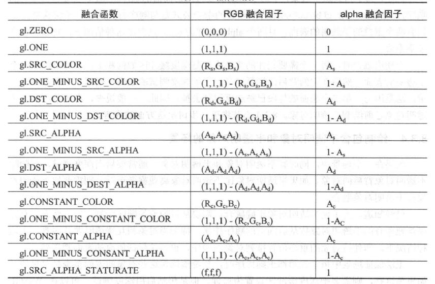

<p align="center">WebGL渲染管线与混合</p>
=


[toc]

#### 一、渲染管线

GPU（图形处理器单元），是显卡的显示核心，之前的渲染管线不可执行着色器程序，称为固定渲染管线；现在能够执行顶点着色器和片元着色器，称之为可编程渲染管线；

渲染管线就是一条渲染流水线，总是由下一个功能单元处理上一个功能单元处理后的数据，详细的流程图如下：

> <p align="center"><strong>顶点着色器</strong><br>（处理缓存区传入的顶点数据）</p>
> <p align="center">↓</p>
> <p align="center"><strong>图元装配</strong><br>（将顶点着色器处理过的数据，组装成三角形、点、线）</p>
> <p align="center">↓</p>
> <p align="center"><strong>光栅化</strong><br>（将图元分解成片元）</p>
> <p align="center">↓</p>
> <p align="center"><strong>片元着色器</strong><br>（处理光栅化的片元数据）</p>
> <p align="center">↓</p>
> <p align="center"><strong>裁剪测试</strong><br>（丢弃没有在裁剪矩形内的片元）</p>
> <p align="center">↓</p>
> <p align="center"><strong>多重采样片元操作</strong><br>（对线框进行抗锯齿处理，使其平滑化）</p>
> <p align="center">↓</p>
> <p align="center"><strong>深度缓存测试</strong><br>（丢弃被遮挡的片元）</p>
> <p align="center">↓</p>
> <p align="center"><strong>混合</strong><br>（处理透明度对象）</p>
> <p align="center">↓</p>
> <p align="center"><strong>抖动</strong><br>（排列颜色缓存）</p>
> <p align="center">↓</p>
> <p align="center">（绘制颜色缓存数据，可以看见画面了）</p>

#### 二、混合

##### 1、概述

混合是把两个颜色组合在一起的技术。(深度测试是替换掉帧缓冲区中的之前的颜色)
以下是开启混合代码：

``` typescript
gl.enable(gl.BLEND);
```

传入片元的颜色称为源颜色（source color），绘制缓冲区中原来片元的颜色称为目标颜色（destination color）。
混合公示通用表示如下：
color<sub>final</sub>=factor<sub>source</sub>*color<sub>source</sub>op factor<sub>dest</sub>*color<sub>dest</sub>
各参数作用如下：

* color<sub>final</sub>——对片段执行融合操作后最终得到的颜色。
* factor<sub>source</sub>——与传入片段的颜色相乘的缩放因子。
* color<sub>source</sub>——传入片元的颜色。
* op——数学运算符，用于把传入片元的颜色和目标片元的颜色分别乘上相应的缩放因子后再进行组合。
* factor<sub>dest</sub>——与目标片元的颜色相乘的缩放因子。
* color<sub>dest</sub>——目标片元的颜色。

##### 2、函数设置

缩放因子可以调用以下两个函数设置：

``` typescript
gl.blendFunc();
gl.blendFuncSeparate();

void belndFunc(Glenum sfactor,GLenum dfactor);
void blendFuncSeparate(GLenum srcRGB,GLenum dstRGB,GLenum srcAlpha,GLenum dstAlpha);
```

调用gl.blendFunc()函数的常见方法如下所示：

``` typescript
gl.blendFunc(gl.SRC_ALPHA,gl.ONE_MINUS_SRC_ALPHA);
```

调用gl.blendFuncSeparatte()函数常见方法如下：

``` typescript
gl.blendFuncSeparate(gl.SRC_ALPHA,gl.ONE_MINUS_SRC_ALPHA,gl.ZERO,gl.ONE);
```

混合函数表：


##### 3、绘制不透明和半透明场景

``` typescript
//1、启用深度测试，设置深度缓存区可写入，禁用混合模式
gl.enable(gl.DEPTH_TEST);
gl.depthMask(true);
gl.disable(gl.BLEND);

//2、绘制不透明对象（根据你自定义的任意顺序）
//3、设置深度缓存只读，启用混合
gl.depthMask(false);
gl.enable(gl.BLEND);

//4、从后到前依次绘制半透明对象
//5、如果要绘制UI在场景的顶层，可以禁用深度测试
gl.disable(gl.DEPTH_TEST);
//6、绘制UI
```

##### 4、修改混合公式默认运算符

混合公式默认运算符是加法，可以调用一下函数：

``` typescript
gl.blendEquation();
gl.blendEquationSeparate();

void blendEquation(GLenum mode);
void blendEquationSeparate(GLenum modeRGB,GLenum modeAlpha);
```

可取如下3个参数：

* gl. FUNC_ADD 源+目标，默认值；
* gl. FUNC_SUBTRACT 源-目标
* gl. FUNC_REVERSE_SUBTRACT 目标-源

##### 5、alpha预乘

可以调用一下函数设置预乘alpha模式：

``` typescript
gl.pixelStorei(gl.UNPACK_PREMULTIPLY_ALPHA_WEBGL,true);
```

由于RGB只已与alpha值相乘，因此对于预乘alpha值，相应的融合公式表示为：
color<sub>final</sub>=colorPreMult<sub>source</sub>+(1-a<sub>source</sub>)*color<sub>dest</sub>
上式中，colorPreMult<sub>source</sub>代表源预乘颜色，融合公式可以用下面的调用来设置：
gl.blendFunc(gl. ONE, gl_ONE_MINUS_SRC_ALPHA); 

